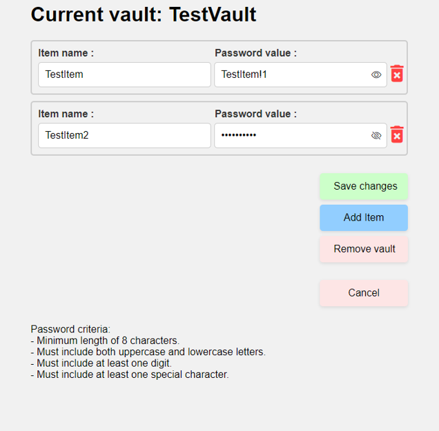

# COMP.SEC.300 Project work

## Introduction
This work was done for [Secure Programming](https://www.tuni.fi/en/study-with-us/secure-programming-fitech) course at Tampere University. The result of the project was a password manager storing encryted passwords into a mongo database. 

**The work is not based on any previous works.**

## Tech
The project was implemented with Python and a web framework called Flask. Mongo database is used to store user information.

## Structure  

    - Environment files, documentation, and actual running file main.py reside in the root folder. 
    - Blueprints folder has Flask blueprints. 
    - Each blueprint handles routes and functionalities relating to the filename. 
    - Logs folder stores logs.
    - Static folder is a default Flaks folder. This folder stores style.css stylesheet.
    - Template folder is also a default Flask folder. This folder stores HTML files.
    - Utils folder stores different python files providing utilities for the application.

    root
    |   - .env
    │   - .gitignore
    │   - docker-compose.yml
    │   - environment.yml
    │   - main.py
    │   - README.md
    │   - requirements.txt
    ├───blueprints
    │       - login.py
    │       - signin.py
    │       - vaults.py
    ├───logs
    │       - * Generated log files *
    ├───static
    │       - style.css
    ├───templates
    │       - create_vault.html
    │       - index.html
    │       - login.html
    │       - show_vault.html
    │       - signin.html
    │       - vaults.html
    └───utils
            - crypto.py
            - mongo.py
            - psw_validation.py

## Secure programming solutions
OWASP Top 10 list provided a checklist for programming solutions. Here are points that were taken into consideration:
    
1. [Security Logging and Monitoring Failures](https://owasp.org/Top10/A09_2021-Security_Logging_and_Monitoring_Failures/)
    - System logging is impelmented. Every POST method functionality is thoroughly logged.
        - All database queries are also logged.
    - Voluntary encryption is implemented for the log files. 

2. [Cryptographic failures](https://owasp.org/Top10/A02_2021-Cryptographic_Failures/)
    - HTTPS is used with self-signed certificates. 
    - No deprecated cryptographic algorithms.
    - Randomness is cryptographically safe.
    - No keys in the source code.
    - All data is stored encrypted and keys are stored as byte arrays.

3. [Vulnerable and Outdated Components](https://owasp.org/Top10/A06_2021-Vulnerable_and_Outdated_Components/)
    - System was developed with Python 3.11.
    - All used cryptography libraries are considered safe libraries. 
        - Used cryptography library uses OpenSSL for cryptographic operations.
    - Tried to find security conserns regarding used components and didn't find any. 

4. [Injections](https://owasp.org/Top10/A03_2021-Injection/)
    - All data used in mongo queries is hashes as byte arrays thus making this vulnerability obsolete.

### Other security related things

1. CSRF prevention
    - This is implemented using Flask CSRF library. All POST methods require a valid CSRF token.

2. Sessions
    - Stored and encrypted server-side. Client only has session key.
    - Max length is set to 30 mins.
    - Session is deleted when browser is closed.

3. Brute-force attack prevention
    - ReCaptcha v3.0 is used to prevent brute-force attacks and bots.

4. Mongo credentials
    - This depend on the user but it is possible to set mongo credentials.

## Testing

### Manual testing
During the development extensive manual testing was done. Manually tested things were:
1. CSRF libarary
2. User sign in, login (in and out).
    - Invalid passwords and usernames were tested multiple times.
3. Vault creation and deletion.
    - Invalid vault names (duplicate, empty or just space) tested.
4. Item creation inside vaults.
    - Invalid names (duplicate, empty or just space) and usernames were tested.

### Automated testing
Automated test have been implemented for following functionalities:
- User log in and sing in
- CRUD for vaults and passwords inside vaults
- Password validation
- Cryptographic functionalities

These tests cover everything the application does. Test files are name accordingly.

## How to setup environment

### Python environment
The are a couple of ways to setup python environment:
1. Use environment.yml for creating a conda environment.
    - Commands
        - **conda env create --file=environment.yml**
        - **conda activate sec_prog2**
2. Use requirements.txt to install python dependencies. 
    - **NOTE:** Python 3.11 was used in developement. Please check that given requirements are compatible with your python version.
    - Commands:
        - **python -m pip install -r requirements** 

### Mongo
The are a couple of ways to setup mongo.
1. Use docker-compose.yml file to create a docker container.
    - .env file's mongo related variables are compatible with this .yml file's mongo settings.
    - command:
        - **docker-compose up --build**
2. Use an installed mongo on your computer.
    - **NOTE:** .env file stores mongo username, password, address and port. 

### .env file
**NOTE: If you are using docker-compose and environment.yml you donä't have to use this**
The .env file contains different parameters for running the application:
- LOG_ENCRYPTION_KEY (32 byte key) : Voluntary
    - This variable contains an encryption key for the logger. If this is used the logger encrypts the output.
    - By removing this you can remove logger encryption.
- RECAPTCHA_SECRET_KEY, RECAPTCHA_SITE_KEY, RECAPTCHA_VERIFY_URL : **MANDATORY**
    - Keys and URL for reCaptcha.
- MONGO_URL and MONGO_PORT : **MANDATORY**
- MONGO_USERNAME and MONGO_PSW : Voluntary

## Using and testing the application
After setting up the environment run **python main.py** and the application is now running at https://localhost:5001.

### Run tests
Test can be run by running **coverage run -m pytest -s** 

### UIs
The UI is very straight forward. 

-   On the index page of localhost:5001 the user can select wether to log in or sign in.  

    

-   On the sing in page the user can input username and password. If the sing in is successful the user is redirected to index page and otherwise they are notified with a red box.

    

-   On the log in page the user can login. The user is redirected to vaults page if the login is successful. Otherwise they are notified with a red box.

    

-   On the vaults page the user can see their existing vault and create new ones.

    

-   On the vault creation page the user can create new vaults. If the vault is created succesfully the user is redirected to vaults page. Otherwise they are notified with a red box.

    
    
-   By clicking a vault the user can create new items inside a vault as well as modifiy and deleted them. The user can also delete the whole vault from this page. When perfrorming actions the user is notified of the action's result accordingly.

    